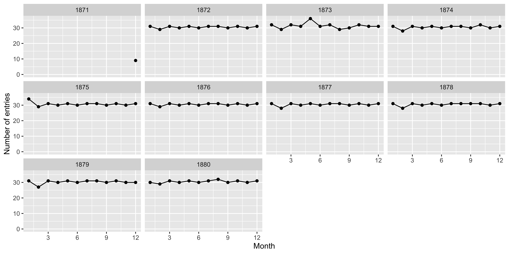
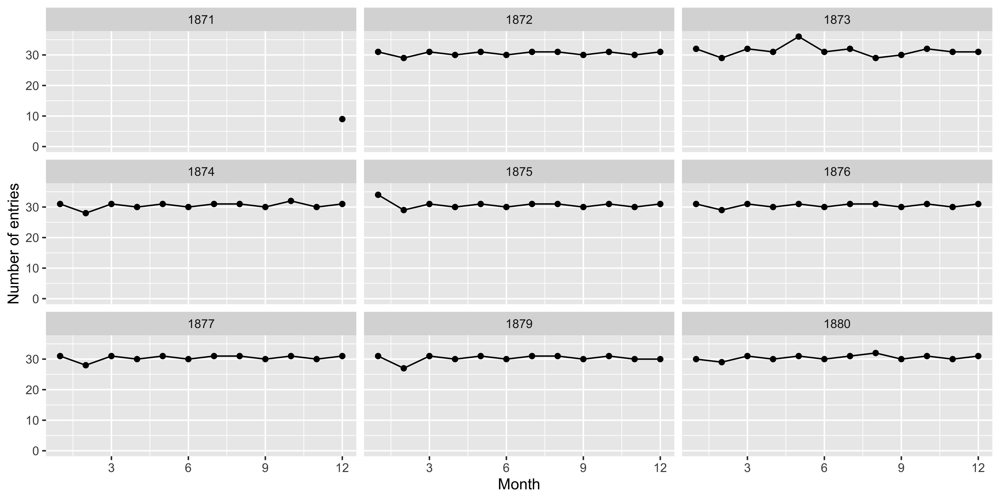
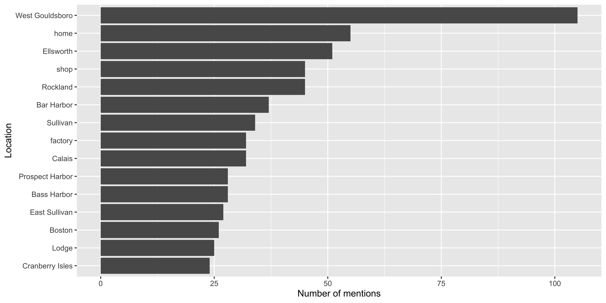
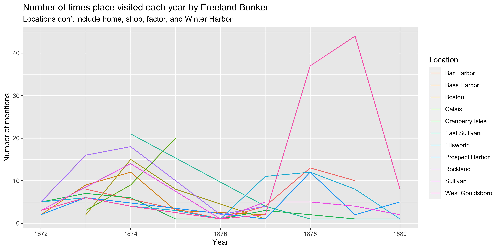
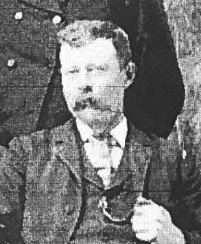

# Acknowledgements

<center>


Slide Structure and Design inspired by Julia Silge 

[ \@juliasilge](https://github.com/juliasilge)

</center>

## Let's install some packages {background-color="white"}


::: {.cell hash='01-fb-tidydata_cache/revealjs/unnamed-chunk-2_ffdd2f1721af53199beee0ac490b2c5f'}

```{.r .cell-code}
install.packages(c("tidyverse", # data wrangling
                   "lubridate", # dates
                   "readxl",
                   "DT")) # reading data
```
:::


## Learning Objectives:

Gain familiarity with 
- How to read in data using `read_excel`
- How to select columns using `select`
- How to create new variables using `mutate`
- How to summarize and arrange data using `count` and `arrange`
- How to group and calculate multiple things 
- How to correct entries using `mutate` and `case_when`
- How to visualize and map the data using `ggplot` and `leaflet`

##  The Journals (1870-1906) {background-image="figs/freeland_bunker_journal.jpg" background-size="45%" background-color="white"}

## 9 journals (1871-1880) transcribed


::: {.cell hash='01-fb-tidydata_cache/revealjs/unnamed-chunk-3_94c1e415bfa0e64ba602e2cbb4867ec3'}

```{.r .cell-code}

library(readxl)
journal_1871_1872 <- read_excel("data/journal_1871_1872.xlsx")
journal_1873 <- read_excel("data/journal_1873.xlsx")
journal_1874 <- read_excel("data/journal_1874.xlsx")
journal_1875 <- read_excel("data/journal_1875.xlsx")
journal_1876 <- read_excel("data/journal_1876.xlsx")
journal_1877 <- read_excel("data/journal_1877.xlsx")
journal_1878 <- read_excel("data/journal_1878.xlsx")
journal_1879 <- read_excel("data/journal_1879.xlsx")
journal_1880 <- read_excel("data/journal_1880.xlsx")
```
:::


## Keeping Track


::: {.cell hash='01-fb-tidydata_cache/revealjs/unnamed-chunk-4_2d12c75968452d14a1dbc3d31801c2cf'}

:::

::: {.cell hash='01-fb-tidydata_cache/revealjs/unnamed-chunk-5_e4788321ba7bba921ef832e556caa701'}

```{.r .cell-code}
# We want to keep track of the journals

journal_1871_1872$journal <- 1
journal_1873$journal <- 2
journal_1874$journal <- 3
journal_1875$journal <- 4
journal_1876$journal <- 5
journal_1877$journal <- 6
journal_1878$journal <- 7
journal_1879$journal <- 8
journal_1880$journal <- 9

journals <- dplyr::bind_rows(journal_1871_1872, journal_1873, journal_1874, 
                             journal_1875, journal_1876, journal_1877, 
                             journal_1878, journal_1879, journal_1880)
```
:::


## We have a lot of variables recorded!


::: {.cell hash='01-fb-tidydata_cache/revealjs/unnamed-chunk-6_9b667b0e34e297348344675f71bee5a6'}

```{.r .cell-code}
glimpse(journals)
#> Rows: 3,951
#> Columns: 35
#> $ date_mdy                <chr> "12/23/1871", "12/24/1871", "12/25/1871", "12/…
#> $ month                   <chr> "December", "December", "December", "December"…
#> $ journal_entry           <chr> "Was married at home in evening by William Ran…
#> $ location                <chr> "home", "NA", "hall", "home", "home", "home", …
#> $ location_accuracy       <chr> NA, NA, NA, NA, NA, NA, NA, NA, NA, NA, NA, NA…
#> $ latitude                <chr> NA, NA, NA, NA, NA, NA, NA, NA, NA, NA, NA, NA…
#> $ latitude_origin         <chr> NA, NA, NA, NA, NA, NA, NA, NA, NA, NA, NA, NA…
#> $ longitude               <chr> NA, NA, NA, NA, NA, NA, NA, NA, NA, NA, NA, NA…
#> $ longitude_origin        <chr> NA, NA, NA, NA, NA, NA, NA, NA, NA, NA, NA, NA…
#> $ transcription           <chr> "confident", "confident", "confident", "confid…
#> $ quantity                <chr> "NA", "NA", "NA", "NA", "NA", "NA", "NA", "NA"…
#> $ unit                    <chr> "NA", "NA", "NA", "NA", "NA", "NA", "NA", "NA"…
#> $ item                    <chr> "NA", "NA", "NA", "NA", "NA", "NA", "NA", "NA"…
#> $ letter                  <chr> "no letter", "no letter", "no letter", "no let…
#> $ letter_from             <chr> NA, NA, NA, NA, NA, NA, NA, NA, NA, NA, NA, NA…
#> $ letter_to               <chr> NA, NA, NA, NA, NA, NA, NA, NA, NA, NA, NA, NA…
#> $ wind_direction_am       <chr> NA, NA, NA, NA, NA, NA, NA, NA, NA, NA, NA, NA…
#> $ wind_direction_pm       <chr> NA, NA, NA, NA, NA, NA, NA, NA, NA, NA, NA, NA…
#> $ wind_direction_night    <chr> NA, NA, NA, NA, NA, NA, NA, NA, NA, NA, NA, NA…
#> $ wind_speed_am           <chr> NA, NA, NA, NA, NA, NA, NA, NA, NA, NA, NA, NA…
#> $ wind_speed_pm           <chr> NA, NA, NA, NA, NA, NA, NA, NA, NA, NA, NA, NA…
#> $ wind_speed_night        <chr> NA, NA, NA, NA, NA, NA, NA, NA, NA, NA, NA, NA…
#> $ weather_condition_am    <chr> NA, NA, NA, NA, NA, NA, NA, NA, NA, NA, NA, NA…
#> $ weather_condition_pm    <chr> NA, NA, NA, NA, NA, NA, NA, NA, NA, NA, NA, NA…
#> $ weather_condition_night <chr> NA, NA, NA, NA, NA, NA, NA, NA, NA, NA, NA, NA…
#> $ temperature_am          <chr> NA, NA, NA, NA, NA, NA, NA, NA, NA, NA, NA, NA…
#> $ temperature_pm          <chr> NA, NA, NA, NA, NA, NA, NA, NA, NA, NA, NA, NA…
#> $ temperature_night       <dbl> NA, NA, NA, NA, NA, NA, NA, NA, NA, NA, NA, NA…
#> $ image_path              <chr> "NA", "NA", "NA", "NA", "NA", "NA", "NA", "NA"…
#> $ image_description       <chr> NA, NA, NA, NA, NA, NA, NA, NA, NA, NA, NA, NA…
#> $ recorder                <chr> "NH", "NH", "NH", "NH", "NH", "NH", "NH", "NH"…
#> $ notes                   <chr> "Esqr? Esquire", "to?", "Christmas tree?", NA,…
#> $ second_check            <chr> "WD", NA, "WD", NA, "WD", NA, NA, NA, NA, NA, …
#> $ journal                 <dbl> 1, 1, 1, 1, 1, 1, 1, 1, 1, 1, 1, 1, 1, 1, 1, 1…
#> $ transcription_accuracy  <chr> NA, NA, NA, NA, NA, NA, NA, NA, NA, NA, NA, NA…
```
:::

## Exploring a subset using `select`


::: {.cell hash='01-fb-tidydata_cache/revealjs/unnamed-chunk-7_e90094aef0a0b448968a1a55a4aae1c5'}

```{.r .cell-code}

(journals_sub <- journals %>%
    select(date_mdy, journal_entry, location))
#> # A tibble: 3,951 × 3
#>    date_mdy   journal_entry                                             location
#>    <chr>      <chr>                                                     <chr>   
#>  1 12/23/1871 Was married at home in evening by William Rand Esqr.      home    
#>  2 12/24/1871 Went to meeting.                                          NA      
#>  3 12/25/1871 Shooting match all day in the evening to Christmas tree … hall    
#>  4 12/26/1871 About home at work fobbing.                               home    
#>  5 12/27/1871 Work about home reed letter from N. H. Higgins Ins agt.   home    
#>  6 12/28/1871 Work about home.                                          home    
#>  7 12/29/1871 To work in shop.                                          shop    
#>  8 12/30/1871 To work in shop.                                          shop    
#>  9 12/31/1871 Went to meeting.                                          NA      
#> 10 1/1/1872   Work in shop.                                             shop    
#> # ℹ 3,941 more rows
```
:::


## Creating date variables using `lubridate`


::: {.cell hash='01-fb-tidydata_cache/revealjs/unnamed-chunk-8_1693ebe88732b63adb39c876e0e39035'}

```{.r .cell-code}
library(lubridate)
(journals_sub <- journals_sub %>%
    mutate(date_mdy = mdy(date_mdy),
           year = year(date_mdy),
           month = month(date_mdy)))
#> # A tibble: 3,951 × 5
#>    date_mdy   journal_entry                                 location  year month
#>    <date>     <chr>                                         <chr>    <dbl> <dbl>
#>  1 1871-12-23 Was married at home in evening by William Ra… home      1871    12
#>  2 1871-12-24 Went to meeting.                              NA        1871    12
#>  3 1871-12-25 Shooting match all day in the evening to Chr… hall      1871    12
#>  4 1871-12-26 About home at work fobbing.                   home      1871    12
#>  5 1871-12-27 Work about home reed letter from N. H. Higgi… home      1871    12
#>  6 1871-12-28 Work about home.                              home      1871    12
#>  7 1871-12-29 To work in shop.                              shop      1871    12
#>  8 1871-12-30 To work in shop.                              shop      1871    12
#>  9 1871-12-31 Went to meeting.                              NA        1871    12
#> 10 1872-01-01 Work in shop.                                 shop      1872     1
#> # ℹ 3,941 more rows
```
:::

## How often did Freeland write? 


::: {.cell hash='01-fb-tidydata_cache/revealjs/unnamed-chunk-9_6b5fa37190acab005443982a2d256f4f'}
::: {.cell-output-display}
{width=3000}
:::
:::


## How often did Freeland write? Code


::: {.cell hash='01-fb-tidydata_cache/revealjs/unnamed-chunk-10_4e1b0b46f539ecd2ebd04db7500f876c'}

```{.r .cell-code}

journals_sub %>%
    filter(is.na(year) == FALSE) %>%
    group_by(month, year) %>%
    summarize(days_written = n()) %>%
    ggplot(aes(x = month, y = days_written)) +
    geom_line() +
    geom_point() +
    facet_wrap(~year) +
    ylim(0, 36) +
    scale_x_continuous(breaks = c(0, 3, 6, 9, 12)) +
    labs(x = "Month", y = "Number of entries")
```
:::


## Where did Freeland go?


::: {.cell hash='01-fb-tidydata_cache/revealjs/unnamed-chunk-11_fd1b4d64087e9c3a123197951554e3c4'}

```{.r .cell-code}
journals_sub %>%
    filter(is.na(location) == FALSE, location != "NA") %>%
    separate_rows(location, sep = ", ") %>%
    count(location) %>%
    arrange(desc(n))
#> # A tibble: 343 × 2
#>    location            n
#>    <chr>           <int>
#>  1 Winter Harbor    1000
#>  2 West Gouldsboro   105
#>  3 home               55
#>  4 Ellsworth          51
#>  5 Rockland           45
#>  6 shop               45
#>  7 Bar Harbor         37
#>  8 Sullivan           34
#>  9 Calais             32
#> 10 factory            32
#> # ℹ 333 more rows
```
:::


## Less common places visited?


::: {.cell hash='01-fb-tidydata_cache/revealjs/unnamed-chunk-12_1e142d76c184388617a75f053a00d32f'}

```{.r .cell-code}
journals_sub %>%
    filter(is.na(location) == FALSE, location != "NA") %>%
    separate_rows(location, sep = ", ") %>%
    count(location) %>%
    slice_min(n, n = 15, with_ties = FALSE) 
#> # A tibble: 15 × 2
#>    location                       n
#>    <chr>                      <int>
#>  1 " Handkerchief Light Ship"     1
#>  2 " North East Harbor"           1
#>  3 "Albany Rail Road Whard"       1
#>  4 "Azores/Western Islands"       1
#>  5 "Bakers Island"                1
#>  6 "Barbacoa Harbor"              1
#>  7 "Barge"                        1
#>  8 "Bass Habor"                   1
#>  9 "Bass Harbobr"                 1
#> 10 "Bath"                         1
#> 11 "Block Island Channel"         1
#> 12 "Boothbay"                     1
#> 13 "Boston Flats"                 1
#> 14 "Boston Harbor"                1
#> 15 "Brooklyn dock"                1
```
:::

## Plotting frequency of visits 


::: {.cell hash='01-fb-tidydata_cache/revealjs/unnamed-chunk-13_ac9a3f99f8fffa400484120a366e8211'}

```{.r .cell-code}
journals_sub %>%
    filter(is.na(location) == FALSE, location != "NA") %>%
    separate_rows(location, sep = ", ") %>%
    count(location) %>%
    slice_max(n, n = 15, with_ties = FALSE) %>%
    ggplot(aes(x = n, y = fct_reorder(location, n))) +
    geom_col() +
    labs(x = "Number of mentions", y = "Location")
```

::: {.cell-output-display}
{width=3000}
:::
:::


## Fixing Mispellings


::: {.cell hash='01-fb-tidydata_cache/revealjs/unnamed-chunk-14_8b99f11e61d6ebeae5add99b6db40f27'}

```{.r .cell-code}
journals_sub %>%
    separate_rows(location, sep = ", ") %>%
    filter(str_detect(string = location, pattern = "C\\.|C |Cranberry")) %>%
    distinct(location)
#> # A tibble: 9 × 1
#>   location             
#>   <chr>                
#> 1 C. Isles             
#> 2 C Isles              
#> 3 C isles              
#> 4 Cranberry Isle harbor
#> 5 Cranberry Isle       
#> 6 Cranberry Isles      
#> 7 Cranberry Islands    
#> 8 Cranberry Island     
#> 9 Cranberry IIsles
```
:::


## Tidying words using `case_when`


::: {.cell hash='01-fb-tidydata_cache/revealjs/unnamed-chunk-15_4db0aebca5c4c062f05b061134be1b3c'}

```{.r .cell-code}
journals_sub <- journals_sub %>%
    separate_rows(location, sep = ", ") %>%
    mutate(location = case_when(location %in% c("C. Isle", "C. Isles", "C Isles", 
                                                "C isles", "Cranberry IIsles", "Cranberry Isle", "Cranberry Isle harbor", "Cranberry Isles", "Cranberry Islands", "Cranberry Island") ~ "Cranberry Isles",
                            TRUE ~ location))


journals_sub %>%
    separate_rows(location, sep = ", ") %>%
    filter(str_detect(string = location, pattern = "C\\.|C |Cranberry")) %>%
    distinct(location)
#> # A tibble: 1 × 1
#>   location       
#>   <chr>          
#> 1 Cranberry Isles
```
:::


## Your Turn: Fix Bass Harbor misspellings


::: {.cell hash='01-fb-tidydata_cache/revealjs/unnamed-chunk-16_19e498cff6df568a0818ac460c999e2a'}

```{.r .cell-code}
journals_sub %>%
    separate_rows(location, sep = ", ") %>%
    filter(str_detect(string = location, pattern = "Bass|bass")) %>%
    distinct(location)
#> # A tibble: 4 × 1
#>   location         
#>   <chr>            
#> 1 Bass Harbor      
#> 2 Bass Harbobr     
#> 3 Bass Habor       
#> 4 Outer Bass Harbor
```
:::

::: {.cell hash='01-fb-tidydata_cache/revealjs/unnamed-chunk-17_cad6657e0547e43401760fea9e76a903'}

```{.r .cell-code}

journals_loc <- journals_loc %>%
    mutate(location = case_when(location %in% c(__________) ~ _______,
                            TRUE ~ location))

```
:::

::: {.cell hash='01-fb-tidydata_cache/revealjs/unnamed-chunk-18_cf9335cd58c3081b432da08549cb3bfe'}

:::


## Where did Freeland visit


::: {.cell hash='01-fb-tidydata_cache/revealjs/unnamed-chunk-19_a578ea0a7cdb56a60f392ede0f15caaf'}
::: {.cell-output-display}
{width=3000}
:::
:::


## Where did Freeland visit each year?


::: {.cell hash='01-fb-tidydata_cache/revealjs/unnamed-chunk-20_73531864ca93c733c320b672f8fdcf17'}
::: {.cell-output-display}
{width=3000}
:::
:::

## Where did Freeland visit each year? Code


::: {.cell hash='01-fb-tidydata_cache/revealjs/unnamed-chunk-21_df9da55f7b1e1ede69ced81928458d46'}

```{.r .cell-code}
journals_loc_count <- journals_sub %>%
    separate_rows(location, sep = ", ") %>%
    filter(location %in% c("West Gouldsboro", "Ellsworth", "Rockland", "Bar Harbor", "Sullivan", "Calais", "Prospect Harbor", "East Sullivan", "Boston", "Bass Harbor", "Cranberry Isles")) %>%
    group_by(year) %>%
    count(location)

journals_loc_count %>%
    ggplot(aes(x = year, y = n, color = location)) +
    geom_line() +
    labs(x = "Year", y = "Number of mentions", color = "Location", title = "Number of times place visited each year by Freeland Bunker", subtitle = "Locations don't include home, shop, factor, and Winter Harbor")
```
:::


## Mapping


::: {.cell hash='01-fb-tidydata_cache/revealjs/unnamed-chunk-22_c66a728dacfe545f7c08dda9392565b6'}

```{.r .cell-code}
location_coordinates <- read_excel(path = "data/location_coordinates.xlsx")

head(location_coordinates, n = 2)
#> # A tibble: 2 × 8
#>   location n_mentions official_name_check latitude longitude recorder checked_by
#>   <chr>         <dbl> <lgl>                  <dbl>     <dbl> <chr>    <lgl>     
#> 1 Winter …       1000 NA                      44.4     -68.1 NH       NA        
#> 2 West Go…        105 NA                      44.5     -68.1 NH       NA        
#> # ℹ 1 more variable: notes <lgl>

loc_df <- journals_sub %>%
    separate_rows(location, sep = ", ")  %>%
    count(location) %>%
    left_join(location_coordinates, by = "location") %>%
    drop_na(latitude)
```
:::


Homework: Add 5 more sets of coordinates to the [location excel file](https://docs.google.com/spreadsheets/d/1vA5YjlsGHQBSmUOFsBpPSJhObK601zE3/edit?usp=sharing&ouid=104076949272458477636&rtpof=true&sd=true)

## Where did Freeland go?


::: {.cell hash='01-fb-tidydata_cache/revealjs/unnamed-chunk-23_9943864c3600fc2603d52699c593d740'}
::: {.cell-output-display}
```{=html}
<div class="leaflet html-widget html-fill-item-overflow-hidden html-fill-item" id="htmlwidget-7e660c839fdef3769343" style="width:3000px;height:1500px;"></div>
<script type="application/json" data-for="htmlwidget-7e660c839fdef3769343">{"x":{"options":{"crs":{"crsClass":"L.CRS.EPSG3857","code":null,"proj4def":null,"projectedBounds":null,"options":{}}},"setView":[[43.5,-66],9,[]],"calls":[{"method":"addProviderTiles","args":["OpenStreetMap",null,null,{"errorTileUrl":"","noWrap":false,"detectRetina":false}]},{"method":"addCircleMarkers","args":[[44.23879938,44.2585131,44.21412573,44.54105229,44.52816854,44.41062098,44.1041007,44.52761858,44.46922347,44.39116851],[-68.34644791,-68.27013482,-68.67589735,-68.42420475,-68.2534335,-68.02456023,-69.10869077,-68.30612654,-68.09937127,-68.09811741],[0.28,0.24,0.12,0.51,0.07,0.28,0.45,0.04,1.05,10],null,null,{"interactive":true,"className":"","stroke":true,"color":"#03F","weight":5,"opacity":0.5,"fill":true,"fillColor":"#03F","fillOpacity":0.2},null,null,null,null,["Bass Harbor","Cranberry Isles","Deer Isle","Ellsworth","Hancock","Prospect Harbor","Rockland","Skillings river","West Gouldsboro","Winter Harbor"],{"interactive":false,"permanent":false,"direction":"auto","opacity":1,"offset":[0,0],"textsize":"10px","textOnly":false,"className":"","sticky":true},null]}],"limits":{"lat":[44.1041007,44.54105229],"lng":[-69.10869077,-68.02456023]}},"evals":[],"jsHooks":[]}</script>
```
:::
:::


## Where did Freeland go?


::: {.cell hash='01-fb-tidydata_cache/revealjs/unnamed-chunk-24_3f94ba4d72e85d2373bdac60534c1491'}

```{.r .cell-code}
library(leaflet)

leaflet(data = loc_df) %>%
     setView(lng = -66, lat = 43.5, zoom = 9) %>%
     addProviderTiles(providers$OpenStreetMap) %>%
     addCircleMarkers(lng = ~longitude, lat = ~latitude, label = ~location, radius = ~n/100)
```
:::


# Thanks! {background-image="figs/p_and_p_cover.png" background-size="cover" background-opacity="0.5"}

<center>



[ \@LaurieLBaker](https://github.com/laurielbaker)

[ lauriebaker@rbind.io](https://lauriebaker.rbind.io)

</center>

::: footer
Slides created with [Quarto](https://quarto.org/)
:::

